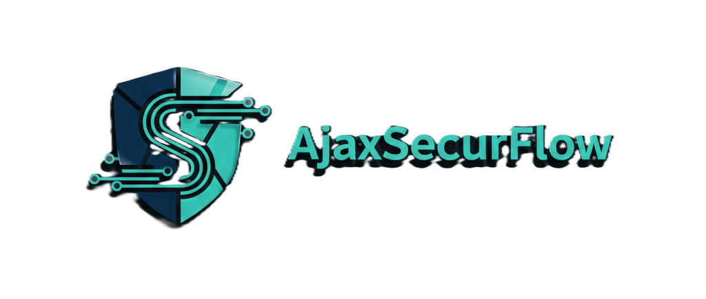

# 

**Industrial-Grade Proxy for Ajax Systems API.**

🌐 **Live Environments:**
- **Frontend / Dashboard:** [https://www.ajaxsecurflow.com](https://www.ajaxsecurflow.com)
- **API Server:** [https://api.ajaxsecurflow.com/docs](https://api.ajaxsecurflow.com)

AjaxSecurFlow is a high-performance, secure API Gateway designed to bridge the gap between end-users and the official Ajax Systems API. It provides a robust SaaS management layer with tiered subscriptions, global rate limiting, and proactive security shielding.

[](https://github.com/PyCQA/bandit)
[](https://github.com/pypa/pip-audit)
[](https://fastapi.tiangolo.com)
[](https://nextjs.org)

---

## 🚀 Quick Start

### 1. Prerequisites
- Docker & Docker Compose
- Ajax Systems Developer Credentials

### 2. Deployment
Choose **one** of the following methods:

#### 2.1 Recommended (Pre-built Images)
This is the fastest way to get started using our verified images from GitHub Container Registry.

```bash
# Download the production compose file
curl -O https://raw.githubusercontent.com/virapa/AjaxSecurFlow/main/docker-compose.ghcr.yml

# Setup environment
curl -O https://raw.githubusercontent.com/virapa/AjaxSecurFlow/main/.env.example
cp .env.example .env
# Edit .env with your keys

# Launch using pre-built images
docker-compose -f docker-compose.ghcr.yml up -d
```

#### 2.2 Alternative (Build from Source)
Use this if you want to modify the code or contribute to the project.

```bash
git clone https://github.com/virapa/AjaxSecurFlow.git
cd AjaxSecurFlow
cp .env.example .env
# Edit .env with your keys

# Build and launch locally
docker-compose up -d --build
```

The API will be available at `http://localhost:8000` and the Dashboard at `http://localhost:3000`.

---

## ✨ Key Features

- **Unified Identity**: Seamless SSO using Ajax Systems credentials.
- **Global Rate Limiting**: Centralized Redis throttling protecting you from upstream bans.
- **Security Shield**: Proactive blocking of scanners and automated probes.
- **Multitenant Billing**: Native Stripe integration + B2B Voucher activation system.
- **Enterprise Auditing**: Immutable request logs with correlation IDs and forensic data.
- **Real-time Telemetría**: Live battery, signal, and system health monitoring.

---

## 🛠 Tech Stack

| Component    | Technology                          |
| ------------ | ----------------------------------- |
| **Core**     | Python 3.11+, FastAPI (Async)       |
| **Logic**    | SQLAlchemy 2.0, Celery, Redis       |
| **Frontend** | Next.js 15, React 19, TailwindCSS 4 |
| **Database** | PostgreSQL 15                       |
| **Testing**  | Pytest, Vitest                      |
| **Infra**    | Docker & Docker Compose             |

---

## 📂 Configuration

| Environment Variable    | Description                        | Default |
| ----------------------- | ---------------------------------- | ------- |
| `DATABASE_URL`          | PostgreSQL connection string       | -       |
| `REDIS_URL`             | Redis connection string            | -       |
| `AJAX_API_KEY`          | Your official Ajax Systems API Key | -       |
| `STRIPE_API_KEY`        | Stripe secret key for billing      | -       |
| `ENABLE_DEVELOPER_MODE` | Bypasses payment for local testing | `False` |

---

## 📚 Documentation

For deep dives into the system architecture and integration:

- **[Architecture Guide](./docs/ARCHITECTURE.md)**: Diagrams and system principles.
- **[Configuration Guide](./docs/CONFIGURATION.md)**: Detailed explanation of `.env` variables.
- **[Security Policy](./docs/SECURITY.md)**: Defense layers and vulnerability reporting.
- **[API References](./backend/docs/API_PERMISSIONS.md)**: Permissions and available endpoints.
- **[Frontend Integration](./frontend/docs/FRONTEND_INTEGRATION.md)**: React guide and components.
- **[Contributing](./docs/CONTRIBUTING.md)**: How to help move the project forward.
- **[Changelog](./CHANGELOG.md)**: History of changes and releases.

---

## 📜 License

This project is licensed under a **Proprietary License**. See the LICENSE file for details.

---

Developed with ❤️ by **virapa**.
