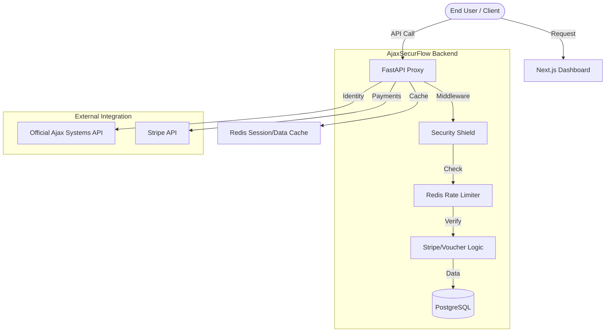

# AjaxSecurFlow Architecture

## System Overview

AjaxSecurFlow operates as a high-security proxy between end-users and the Ajax Systems API. It adds a multi-tenant business layer (Subscriptions, Auditing, Rate Limiting) on top of the standard Ajax functionality.

## High-Level Flow

## Architectural Decissions

### 1. Modular Monolith
The project is structured into vertical modules (`backend/app/modules`) to ensure isolation of concerns. 
- **Auth**: Local authentication tied to Ajax IdP.
- **Ajax**: Upstream communication and endpoint mapping.
- **Billing**: Stripe integration and Voucher logic.
- **Security**: Auditing and Request Shielding.

### 2. Identity Synchronization
Instead of maintaining a separate user database for credentials, AjaxSecurFlow validates credentials against Ajax Systems on first login and auto-provisions the local user profile. This ensures a "Single Sign-On" experience for users familiar with the official Ajax app.

### 3. Shared Global Rate Limiter
To prevent being banned by the official Ajax API, all requests from all tenants are throttled through a shared Redis counter. If the limit (100 req/min) is reached, requests are queued in an asynchronous buffer rather than simply dropped.

### 4. Dual-State Session Management
The system handles two session types:
1. **Local Session**: JWT-based, managed by our FastAPI backend.
2. **Ajax Session**: Managed by Redis, mapped to the user's email, and automatically refreshed by the backend.

## Deployment Strategy
The system is fully containerized via Docker.
- `backend`: FastAPI server.
- `worker`: Celery worker for background synchronization and Stripe webhooks.
- `frontend`: Next.js optimized build.
- `postgres`: Data persistence.
- `redis`: Shared cache and broker.
